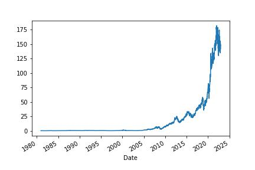
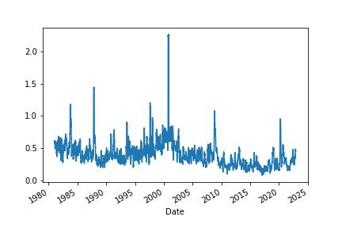
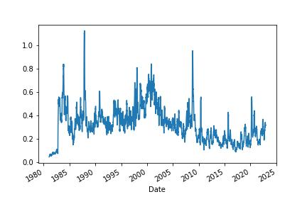
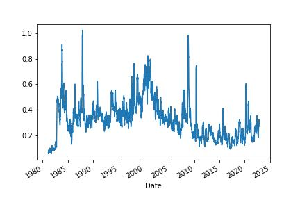
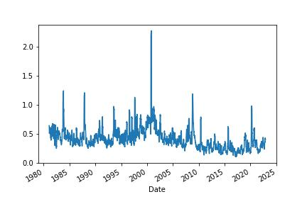

# Compute Volatility 6 Ways Most People Don’t Know

Statistical volatility (also called historic or realized volatility) is a measurement of how much the price or returns of stock value. It’s used to optimize portfolios, detect regime changes, and price derivatives. The most common way to measure statistical volatility is the standard deviation.

As it turns out, there are some downsides to using standard deviation that most people don’t consider.

Libraries used:
math
numpy
yfinance

---

**File:** [Compute Volatility](ComputeVolatility.ipynb)

---

A quick plot of the daily close shows us the price chart of Apple.

# Standard Deviation

We’ll start with the standard deviation. Standard deviation measures how widely returns are dispersed from the average return. It’s the most common (and biased) estimator of volatility.

# Parkinson

Parkinson’s volatility uses the stock’s high and low price of the day rather than just close to close prices. It’s useful to capture large price movements during the day.

# Garman-Klass

Garman-Klass volatility extends Parkinson’s volatility by taking into account the opening and closing price. As markets are most active during the opening and closing of a trading session, it makes volatility estimation more accurate.

# Hodges-Tompkins
Hodges-Tompkins volatility is a bias correction for estimation using an overlapping data sample that produces unbiased estimates and a substantial gain in efficiency.

# Rogers-Satchell
Rogers-Satchell is an estimator for measuring the volatility of securities with an average return not equal to zero. Unlike Parkinson and Garman-Klass estimators, Rogers-Satchell incorporates a drift term (mean return not equal to zero).

# Yang-Zhang
Yang-Zhang volatility is the combination of the overnight (close-to-open volatility), a weighted average of the Rogers-Satchell volatility and the day’s open-to-close volatility.

---

### Which One Do I Use?

Each measure has tradeoffs you must consider. Most practitioners will choose the one they believe captures the information they think is relevant. In time, I will build a simple trading strategy based on different volatility measures.
